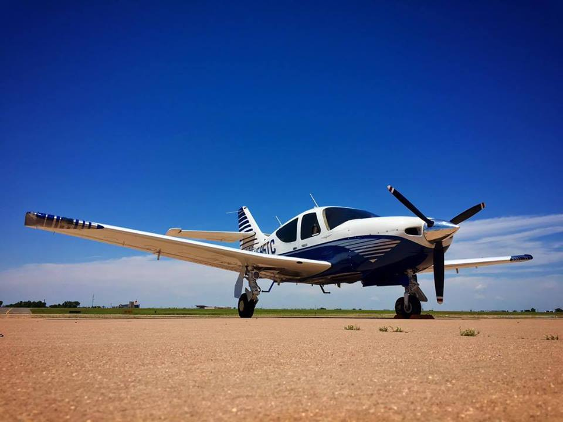

## Welcome to N595TC!

I'm guessing you got here from Trade-A-Plane or Controller. This domain was registered to host various documents related to the aircraft. And yes, if you get the airplane you can have the domain and this website with it.

<h3><a name="logbooks" style="color: #000099; text-decoration: none;">Logbooks</a></h3>

Click on the below links to view. 

Suggestion: the POH has chapter markers for each section but those may or may not show up in a web browser. Due to the amount of upgrades this airplane has, the whole book is quite large.  If you download the POH and open it offline in Adobe reader or Preview on a Mac, you'll see chapter markers which make navigating it much easier.  The 2017 annual has *just* been completed, all documentation is current but for the GTX345 337 which has not been processed by the FAA yet.

[POH](POH.pdf)

[Airframe](Airframe.pdf)

[Avionics](Avionics.pdf)

[Engine](Engine.pdf)

[Prop](Prop.pdf)

[STCs](STCs.pdf)

[Weight-Balance](WB.pdf)

Additionally, here are the invoices for the avionics and A/C system.

[A/C Invoice](ACinvoice.pdf)

[Avionics Invoice](AVinvoice.pdf)
