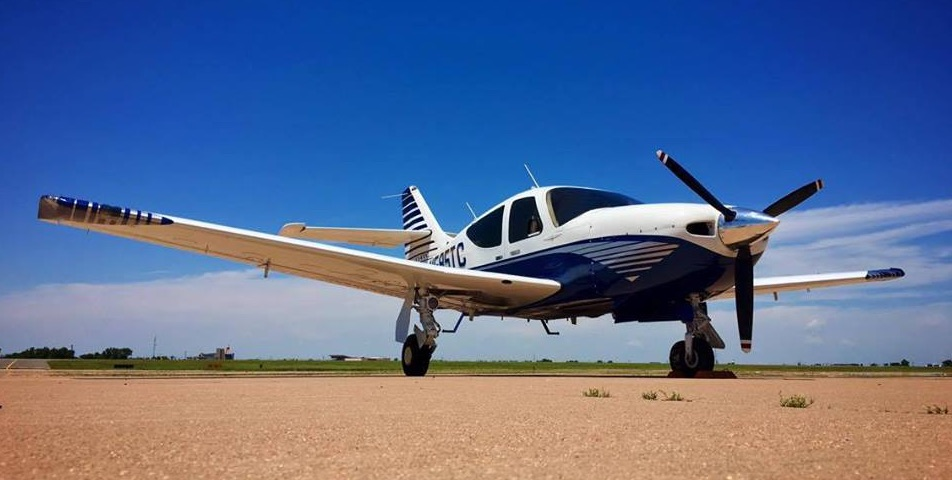

## Welcome to N595TC!

I'm guessing you got here from Trade-A-Plane or Controller. This domain was registered to host various documents related to the aircraft. And yes, if you get the airplane you can have the domain and this website with it.

<h3><a name="panel" style="color: #000099; text-decoration: none;">Panel Details</a></h3>

* New custom fabricated panel with silkscreened placards
* JPI 930 primary engine monitor/gauges
* Aspen 2500 + obstacles + synthetic vision
* Garmin ADS-B unlock on the MFD
* Garmin GTX345 transponder
* Garmin GNS480 GPS
* Garmin SL30 secondary comm
* PS Engineering 8000B audio panel
* STEC55X autopilot factory overhauled in 2017 (with yaw, trim, preselect on Aspen)
* WX900 stormscope
* original King AI, mechanical airspeed, and STEC turn coordinator retained
* powered Bose plugs in the panel for front two seats
* two Bose A20 headsets will come with the airplane
* USB ports in the panel
* PA32 glovebox on the right side

Here is the invoice for the avionics upgrade.

[Avionics Invoice](AVinvoice.pdf)

<h3><a name="acsystem" style="color: #000099; text-decoration: none;">A/C System</a></h3>

The A/C system in this aircraft was installed in 2016 by [Air Center, Inc](http://aircenterinc.com). It's an electric motor driven system, which offers some benefits over engine driven systems.  Firstly, the airplane can be pre-cooled with supplemental electrical power from a start-cart, you can call ahead and have the airplane cooled by the ground service crew before you get there. Secondly, since the system doesn't need to be attached to the engine it is mounted in the tail where heavier remote-mounted avionics *used* to be.  The shift of modern, lightweight avionics forward to the instrument panel tends to cause weight and balance issues on many aircraft. Putting the weight back into the tail in the form of an A/C system restores the 'factory' flight characteristcs of the airplane and solves those forward shifting CG issues.

Here is the invoice for the A/C system.

[A/C Invoice](ACinvoice.pdf)

<h3><a name="logbooks" style="color: #000099; text-decoration: none;">Logbooks</a></h3>

Click on the below links to view. 

Suggestion: the POH has chapter markers for each section but those may or may not show up in a web browser. Due to the amount of upgrades this airplane has, the whole book is quite large.  If you download the POH and open it offline in Adobe reader or Preview on a Mac, you'll see chapter markers which make navigating it much easier.  

[POH](POH.pdf)

[Airframe](Airframe.pdf)

[Avionics](Avionics.pdf)

[Engine](Engine.pdf)

[Prop](Prop.pdf)

[STCs](STCs.pdf)

[Weight-Balance](WB.pdf)

If you're interested in this aircraft feel free to contact me via the email link above.  Unfortunately I just don't have time to fly it enough to justify keeping it.  This is the best equipped Commander 114 in the United States, arguably the best equipped airplane for sale for less than $200,000 on the market.  There is nothing else out there with such a low total time and modern equipment for sale at this price point.
